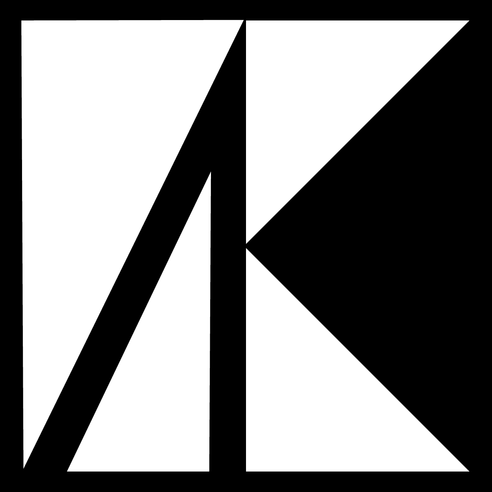

<p align="center">
  
</p>

<h1 align="center">eAccountingServer.Template</h1>

<p align="center">
  🧱 A clean, scalable and modular .NET Web API template built using Clean Architecture principles.
</p>

<p align="center">
  
  
  
</p>

---

## 📦 Project Structure

This template follows the Clean Architecture structure:

📁 eAccountingServer.Template <br>
│<br>
├── 📁 eAccountingServer.Application → Business rules,<br>
├── 📁 eAccountingServer.Domain → Core entities and value objects<br>
├── 📁 eAccountingServer.Infrastructure → Data access (EF Core), service implementations<br>
├── 📁 eAccountingServer.WebApi → API endpoints, OData setup, DI config<br>

---

## 🚀 Getting Started

### 1. Clone the repository

```bash
git clone https://github.com/taberkkaya/eAccountingServer.Template.git
cd eAccountingServer.Template
```

### 2. Set your connection string

Edit the appsettings.json file in the eAccountingServer.WebApi project:

```json
"ConnectionStrings": {
  "SqlServer": "Your-SQL-Server-Connection-String-Here"
}
```

---

Make sure you have dotnet-ef installed globally.<br>

### Install it using:

```
dotnet tool install --global dotnet-ef
```

---

## 🧰 Technologies Used

This template leverages the following frameworks and libraries:

| Technology                                                                                                  | Description                                               |
| ----------------------------------------------------------------------------------------------------------- | --------------------------------------------------------- |
| [.NET 9](https://dotnet.microsoft.com/)                                                                     | Core framework for the API                                |
| [Entity Framework Core](https://learn.microsoft.com/en-us/ef/core/)                                         | ORM for database access                                   |
| [Mapster](https://github.com/MapsterMapper/Mapster)                                                         | Lightweight and fast object mapping library               |
| [FluentValidation](https://docs.fluentvalidation.net/)                                                      | Elegant and fluent validation rules                       |
| [Scrutor](https://github.com/khellang/Scrutor)                                                              | Assembly scanning and DI registration                     |
| [OData](https://learn.microsoft.com/en-us/odata/)                                                           | Enables rich querying capabilities                        |
| [System.Threading.RateLimiting](https://learn.microsoft.com/en-us/dotnet/api/system.threading.ratelimiting) | Built-in rate limiting for APIs                           |
| [RepositoryKit](https://github.com/taberkkaya/RepositoryKit)                                                | Implements the repository and unit of work pattern        |
| [ResultKit](https://github.com/taberkkaya/ResultKit)                                                        | Provides consistent result wrapping for service responses |

---

## ✅ Features

✔️ Clean Architecture with layer separation

✔️ Entity Framework Core integration

✔️ Generic Repository & Unit of Work

✔️ OData filtering, sorting, pagination

✔️ Rate Limiting with System.Threading.RateLimiting

✔️ Scalar/OpenAPI support

✔️ Scalable DI setup via Scrutor

---

### ✨ Contribution

> Feel free to fork this repository and contribute your improvements.

---

### 🪪 License

> This project is open-source and available under the MIT License.

---

### 🧠 Inspired By

> This project is inspired by the work of [Taner Saydam](https://github.com/TanerSaydam).  
> Check out his GitHub profile and repositories for more: https://github.com/TanerSaydam

---

<p align="center">  </p>
